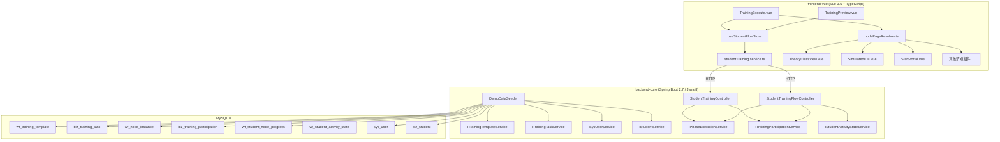
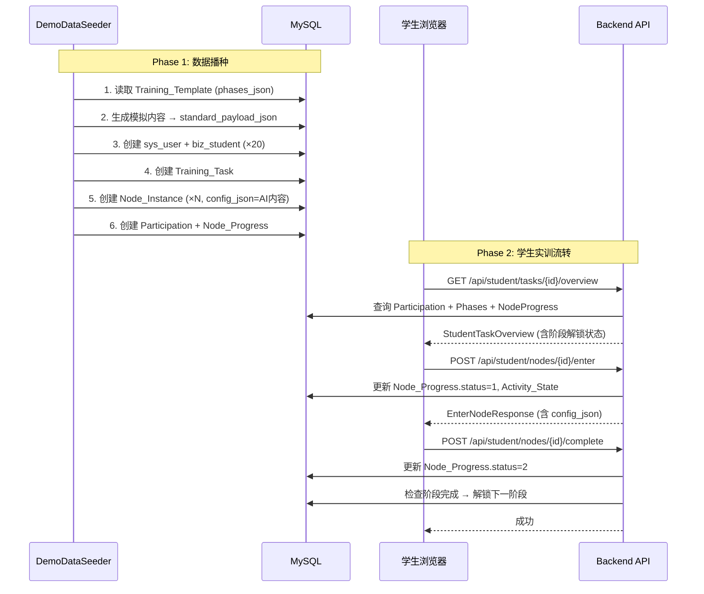
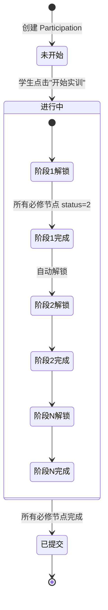
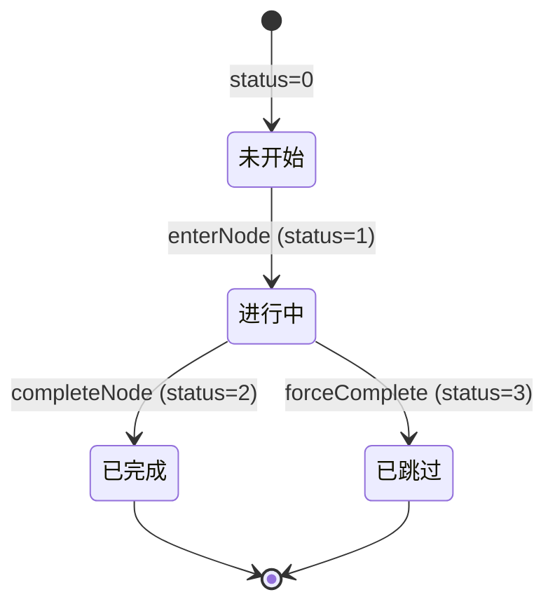

# Design Document: Student Training Demo

## Overview

本设计文档描述学生实训演示模块（Student Training Demo）的技术架构和实现方案。该模块的核心目标是：在现有编排系统基础上，通过后端 Seeder 生成高质量模拟数据入库，创建实训任务并分配给演示班级，然后实现学生端按阶段、按节点顺序动态路由流转的完整实训体验。

**关键设计决策：**
- 演示数据通过 Spring Boot CommandLineRunner 或 REST 端点触发的 Seeder 服务生成，绕过 AI 引擎
- 前端复用现有 `nodePageResolver` 动态组件加载机制，新增 `theory_class` 映射
- 学生端实训流转复用现有 `useStudentFlowStore` + `studentTraining.service.ts` 架构
- 阶段解锁逻辑在后端 `IPhaseExecutionService` 中实现，前端通过 `PhaseProgress.is_unlocked` 驱动 UI

## Architecture

### 系统架构图



### 数据流转



## Components and Interfaces

### 后端组件

#### 1. DemoDataSeeder

**职责：** 生成演示数据并入库，作为 Spring Bean 通过 REST 端点或 CommandLineRunner 触发。

```java
// 位置: backend-core/.../service/impl/DemoDataSeederService.java
@Service
public class DemoDataSeederService {
    
    /** 执行完整的演示数据播种流程 */
    public DemoSeedResult seedAll();
    
    /** 步骤1: 生成模拟AI内容并写入模板 */
    public void generateAndSeedContent(Long templateId);
    
    /** 步骤2: 创建演示学生账号 */
    public void createDemoStudents(int count);
    
    /** 步骤3: 创建实训任务并分配 */
    public void createTaskAndAssign(Long templateId, Long classId);
}
```

**触发方式：**
```java
// 位置: backend-core/.../controller/InitController.java (已存在)
@PostMapping("/api/public/demo/seed")
public ApiResult<DemoSeedResult> seedDemoData();
```

#### 2. StudentTrainingController (扩展)

**职责：** 提供学生端实训数据获取和状态流转的 REST API。

| 端点 | 方法 | 描述 |
|------|------|------|
| `/api/student/tasks/{taskId}/overview` | GET | 获取实训任务总览（阶段、节点、进度） |
| `/api/student/tasks/{taskId}/current-position` | GET | 获取学生当前位置 |
| `/api/student/tasks/{taskId}/start` | POST | 开始实训（Participation status 0→1） |
| `/api/student/nodes/{nodeInstanceId}/enter` | POST | 进入节点 |
| `/api/student/nodes/{nodeInstanceId}/complete` | POST | 完成节点 |
| `/api/student/nodes/{nodeInstanceId}/content` | GET | 获取节点配置内容 |

#### 3. IPhaseExecutionService (扩展)

**职责：** 阶段解锁逻辑和顺序控制。

```java
public interface IPhaseExecutionService {
    /** 检查并执行阶段解锁 */
    void checkAndUnlockNextPhase(Long participationId, String currentPhaseId);
    
    /** 判断阶段是否已完成 */
    boolean isPhaseComplete(Long participationId, String phaseId);
    
    /** 获取学生的阶段解锁状态列表 */
    List<PhaseUnlockStatus> getPhaseUnlockStatuses(Long participationId);
}
```

### 前端组件

#### 1. nodePageResolver.ts (扩展)

新增 `theory_class` 映射到 `TheoryClassView.vue`（新组件，幻灯片模式）：

```typescript
// 新增映射
theory_class: defineAsyncComponent(() => import('./studentTraining/TheoryClassView.vue')),
```

#### 2. TheoryClassView.vue (新建)

**职责：** 理论实训幻灯片展示组件，接收 `config_json.slides` 数据。

```typescript
// Props 接口
interface TheoryClassViewProps {
  nodeInstanceId: number
  nodeConfig: {
    slides: Slide[]
  }
}

interface Slide {
  type: 'theory' | 'intro' | 'code' | 'quiz' | 'summary'
  title: string
  content: string
  bullet_points?: string[]
  key_points?: string[]
  code?: string
  output?: string
  questions?: QuizQuestion[]
}

interface QuizQuestion {
  question: string
  options: string[]
  answer: string
}
```

#### 3. useStudentFlowStore (复用)

现有 store 已满足需求，核心 actions：
- `loadTaskOverview(taskId)` — 加载实训总览
- `enterNode(nodeInstanceId)` — 进入节点
- `completeNode(nodeInstanceId)` — 完成节点
- `isNodeAccessible(nodeInstanceId)` — 检查节点可访问性

#### 4. Vue Router 导航守卫

```typescript
// 位置: frontend-vue/src/router/modules/training.ts
// 在实训执行路由上添加 beforeEnter 守卫
{
  path: '/student/training/:taskId/execute',
  component: TrainingExecute,
  beforeEnter: async (to, from, next) => {
    // 验证阶段解锁状态，未解锁则重定向
  }
}
```

## Data Models

### 演示数据生成的 JSON 结构

#### theory_class 节点 config_json 格式

```json
{
  "slides": [
    {
      "type": "intro",
      "title": "Python列表基础",
      "content": "列表是Python中最常用的数据结构之一...",
      "bullet_points": ["有序集合", "可变长度", "支持多种数据类型"]
    },
    {
      "type": "theory",
      "title": "列表的创建方式",
      "content": "Python提供了多种创建列表的方式...",
      "bullet_points": ["字面量语法 []", "list() 构造函数", "列表推导式"]
    },
    {
      "type": "code",
      "title": "列表操作示例",
      "content": "以下代码演示了列表的基本操作",
      "code": "numbers = [3, 1, 4, 1, 5]\nnumbers.sort()\nprint(numbers)",
      "output": "[1, 1, 3, 4, 5]"
    },
    {
      "type": "quiz",
      "title": "知识检测",
      "content": "请回答以下问题",
      "questions": [
        {
          "question": "以下哪个方法会修改原列表？",
          "options": ["sorted()", "list.sort()", "list[::-1]", "reversed()"],
          "answer": "list.sort()"
        }
      ]
    },
    {
      "type": "summary",
      "title": "本节小结",
      "content": "本节学习了列表的基础操作",
      "key_points": ["列表是可变序列", "sort()原地排序", "切片创建新列表"]
    }
  ]
}
```

#### coding_class 节点 config_json 格式

```json
{
  "coding_task": {
    "description": "实现冒泡排序算法，对给定的整数列表进行升序排列",
    "code_template": "def bubble_sort(arr):\n    \"\"\"实现冒泡排序\n    Args:\n        arr: 待排序的整数列表\n    Returns:\n        排序后的列表\n    \"\"\"\n    # TODO: 在此实现冒泡排序\n    pass",
    "hints": [
      "冒泡排序通过相邻元素比较和交换实现",
      "外层循环控制轮数，内层循环控制每轮比较次数",
      "每轮结束后最大元素会'冒泡'到末尾"
    ],
    "test_cases": [
      {"description": "普通数组", "input": "[3, 1, 4, 1, 5]", "expected": "[1, 1, 3, 4, 5]"},
      {"description": "已排序数组", "input": "[1, 2, 3]", "expected": "[1, 2, 3]"},
      {"description": "逆序数组", "input": "[5, 4, 3, 2, 1]", "expected": "[1, 2, 3, 4, 5]"},
      {"description": "空数组", "input": "[]", "expected": "[]"}
    ],
    "language": "python"
  }
}
```

#### standard_payload_json 整体格式

```json
{
  "node_canvas_id_1": {
    "ai_generated_content": {
      "slides": [...]
    }
  },
  "node_canvas_id_2": {
    "ai_generated_content": {
      "coding_task": {...}
    }
  }
}
```

### 状态机模型



### 节点进度状态流转



## Correctness Properties

*A property is a characteristic or behavior that should hold true across all valid executions of a system—essentially, a formal statement about what the system should do. Properties serve as the bridge between human-readable specifications and machine-verifiable correctness guarantees.*

### Property 1: 演示数据内容格式一致性

*For any* theory_class 节点生成的 config_json，其 slides 数组中每个元素必须包含 type（取值为 theory/intro/code/quiz/summary 之一）和 title 字段；当 type 为 code 时必须额外包含 code 和 output 字段；当 type 为 quiz 时必须包含 questions 数组且每个元素含 question、options、answer 字段。

**Validates: Requirements 1.2**

### Property 2: 编码实训数据格式一致性

*For any* coding_class 节点生成的 config_json，其 coding_task 对象必须包含 description（≤500字符）、code_template（非空字符串）、hints（1-5条）、test_cases（2-10条，每条含 description/input/expected）和 language（值为 "python"）字段。

**Validates: Requirements 1.3**

### Property 3: Seeder 幂等性

*For any* 已存在的演示学生用户名集合，重复执行 DemoDataSeeder 后，数据库中该用户名对应的记录数量不变（不产生重复），且不抛出异常。

**Validates: Requirements 2.5**

### Property 4: 阶段顺序解锁不变量

*For any* 学生的阶段列表，如果阶段 N 的 is_unlocked=true 且 N>1，则所有 sort_num < N 的阶段的 is_complete 必须为 true。

**Validates: Requirements 5.1, 5.2**

### Property 5: 节点完成触发阶段解锁

*For any* 阶段内所有 is_required=true 的节点，当它们的 Node_Progress status 全部变为 2 时，该阶段的 is_complete 应变为 true，且 sort_num 紧邻的下一阶段的 is_unlocked 应变为 true。

**Validates: Requirements 5.2**

### Property 6: 进度百分比计算正确性

*For any* 学生的节点进度集合，进度百分比应等于 `round(已完成节点数 / 总节点数 × 100)`，结果范围为 0-100 的整数。

**Validates: Requirements 8.3**

### Property 7: 节点进入状态转换正确性

*For any* 节点进度记录，当 status 为 0 或 1 时调用 enterNode，结果 status 应为 1 且 entered_at 非空；当 status 为 2 或 3 时调用 enterNode，记录不应被修改。

**Validates: Requirements 7.1, 7.2**

### Property 8: 停留时长累加正确性

*For any* 节点完成操作，stay_duration_seconds 应等于之前累计值加上 (当前时间 - entered_at) 的秒数差值，且结果为非负整数。

**Validates: Requirements 7.3**

### Property 9: 实训状态流转完整性

*For any* Participation 记录，状态只能按 0→1→2 的顺序流转：status=0 时只能转为 1（开始实训），status=1 时只能转为 2（所有必修节点完成），不允许逆向或跳跃转换。

**Validates: Requirements 8.1, 8.2**

## Error Handling

### 后端错误处理

| 场景 | 处理方式 | HTTP 状态码 |
|------|----------|-------------|
| 模板不存在或 phases_json 为空 | Seeder 终止，返回错误信息 | 400 |
| 班级无学生记录 | 跳过 Participation 创建，输出警告 | 200 (partial) |
| 重复执行 Seeder | 跳过已存在记录，不抛异常 | 200 |
| 学生访问未解锁阶段的节点 | 返回 403 + 错误信息 | 403 |
| 节点类型未注册 | 返回 400 + node_type 信息 | 400 |
| Participation 不存在 | 返回 404 | 404 |
| 实训已过期 | 返回 403 + 过期提示 | 403 |

### 前端错误处理

| 场景 | 处理方式 |
|------|----------|
| 实训数据加载失败 | 显示错误提示 + 重试按钮 |
| 节点组件加载失败 | defineAsyncComponent 的 errorComponent 展示错误 |
| 未注册的 node_type | resolveNodePage 返回 null，显示错误提示 |
| 路由守卫拦截 | 重定向到当前解锁阶段的第一个未完成节点 |
| 网络请求超时 | store.error 展示错误信息，提供重试 |

## Testing Strategy

### 单元测试

**后端 (JUnit 5 + Mockito):**
- `DemoDataSeederService`: 测试内容生成格式、幂等性、错误处理
- `IPhaseExecutionService`: 测试阶段解锁逻辑、边界条件
- `StudentTrainingFlowController`: 测试 API 响应格式、权限校验

**前端 (Vitest):**
- `nodePageResolver.ts`: 测试所有 node_type 映射正确性
- `useStudentFlowStore`: 测试状态管理逻辑、计算属性
- `TheoryClassView.vue`: 测试幻灯片渲染、导航逻辑

### 属性测试 (Property-Based Testing)

**库选择：** 后端使用 jqwik (Java PBT 库)，前端使用 fast-check (TypeScript PBT 库)

**配置：** 每个属性测试最少运行 100 次迭代。

**标签格式：** `Feature: student-training-demo, Property {N}: {property_text}`

| Property | 测试目标 | 生成器策略 |
|----------|----------|-----------|
| Property 1 | theory_class JSON 格式验证 | 生成随机 slides 数组，验证结构约束 |
| Property 2 | coding_class JSON 格式验证 | 生成随机 coding_task，验证字段约束 |
| Property 3 | Seeder 幂等性 | 生成随机用户名集合，重复执行验证无重复 |
| Property 4 | 阶段解锁不变量 | 生成随机阶段状态组合，验证解锁前提 |
| Property 5 | 节点完成触发解锁 | 生成随机节点完成序列，验证阶段状态 |
| Property 6 | 进度百分比计算 | 生成随机节点数和完成数，验证百分比 |
| Property 7 | 节点进入状态转换 | 生成随机初始状态，验证转换规则 |
| Property 8 | 停留时长累加 | 生成随机时间序列，验证累加正确性 |
| Property 9 | 实训状态流转 | 生成随机操作序列，验证状态机约束 |

### 集成测试

- 端到端 Seeder 执行：验证从模板读取到所有数据入库的完整流程
- 学生实训流转：验证从开始实训到完成所有阶段的完整路径
- 路由守卫：验证未解锁阶段的访问拦截和重定向
