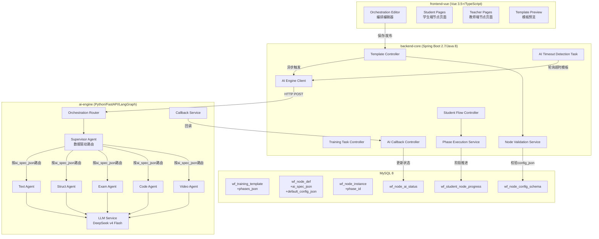
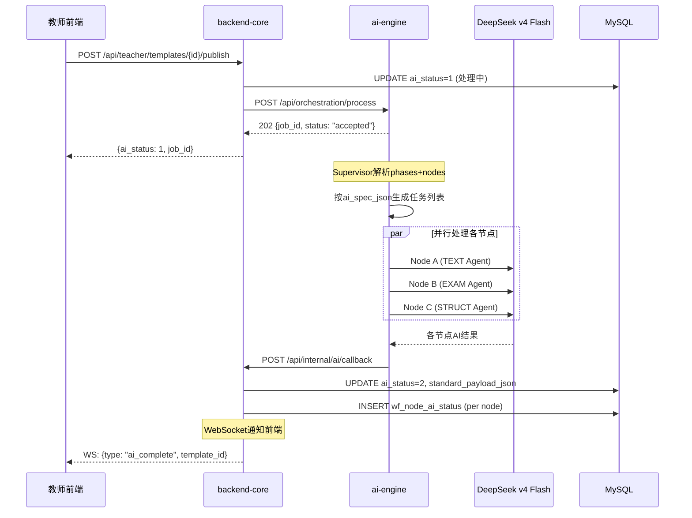
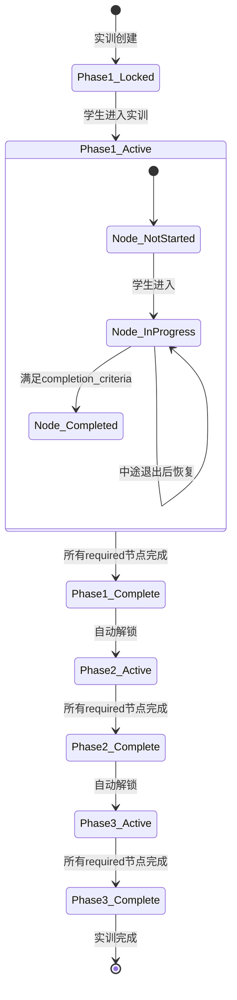

# 技术设计文档：实训编排节点AI重设计

## Overview

本设计文档描述AI智构实训平台编排节点系统的全面重设计方案。核心目标是引入阶段维度（Phase）实现全流程闭环式实训编排，建立节点级AI规格声明体系实现解耦路由，重构AI处理管线为节点级独立架构，并切换LLM引擎至DeepSeek v4 Flash。

### 设计目标

1. **阶段化编排**：支持教师自定义多阶段（课前/课中/课后）实训流程
2. **节点AI解耦**：每个节点类型通过`ai_spec_json`声明AI需求，Supervisor基于声明动态路由
3. **可靠AI触发**：模板发布后AI处理可靠触发、支持节点级状态追踪和选择性重试
4. **LLM引擎切换**：从Qwen无缝切换至DeepSeek v4 Flash
5. **全覆盖页面**：每个节点同时实现教师端和学生端页面
6. **6维度配置**：统一节点配置为6维度JSON结构，配合JSON Schema校验

### 设计决策

| 决策 | 选择 | 理由 |
|------|------|------|
| AI路由机制 | 数据驱动（ai_spec_json） | 新增节点无需修改代码，仅需注册数据库记录 |
| 阶段存储 | phases_json字段 + phase_id外键 | 灵活支持动态阶段数量，避免固定表结构 |
| AI状态追踪 | 独立wf_node_ai_status表 | 节点级粒度追踪，支持选择性重试 |
| 配置校验 | JSON Schema + wf_node_config_schema表 | 运行时校验，schema可独立演进 |
| LLM切换 | 环境变量配置 | 零代码修改切换，支持多环境部署 |
| 前端节点页面 | 动态组件加载 | 按node_type动态resolve组件，避免巨型switch |

---

## Architecture

### 系统架构总览



### AI处理管线时序图



### 阶段推进状态机



---

## Components and Interfaces

### 1. AI Engine — Supervisor Agent（重构）

当前Supervisor使用硬编码的`ROUTING_TABLE`字典路由节点到Agent。重构为数据驱动路由，从请求中携带的`ai_spec_json`动态决定路由。

```python
# ai-engine/agents/supervisor.py (重构后)

from models.schemas import AgentTask, AgentType, ExecutionPlan, PhaseNode

VALID_AGENT_TYPES = {"TEXT", "STRUCT", "EXAM", "CODE", "VIDEO"}


def _should_process_node(node: dict, ai_spec: dict | None) -> bool:
    """
    判断节点是否需要AI处理。
    
    条件：
    1. ai_spec不为None
    2. ai_spec.target_agent在合法枚举范围内
    3. 节点config中存在至少一个ai_flags声明的开关为True，
       或存在source_mode="ai"的字段
    """
    if ai_spec is None:
        return False
    
    target_agent = ai_spec.get("target_agent", "")
    if target_agent not in VALID_AGENT_TYPES:
        logger.warning(f"Node {node.get('node_id')}: invalid target_agent '{target_agent}'")
        return False
    
    config = node.get("config", {})
    ai_flags = ai_spec.get("ai_flags", [])
    
    # Check if any declared AI flag is enabled
    for flag in ai_flags:
        if config.get(flag) is True:
            return True
    
    # Check for source_mode == "ai"
    for key, value in config.items():
        if key == "source_mode" and value == "ai":
            return True
    
    return False


def detect_ai_nodes_phased(canvas_json: dict) -> list[AgentTask]:
    """
    遍历所有阶段的所有节点，基于ai_spec_json动态路由。
    
    canvas_json结构（重构后）:
    {
        "orchestration_id": "...",
        "phases": [
            {
                "phase_id": "...",
                "phase_name": "课前阶段",
                "sort_num": 1,
                "nodes": [...],
                "edges": [...]
            },
            ...
        ]
    }
    """
    tasks: list[AgentTask] = []
    seen_node_ids: set[str] = set()
    orchestration_id = canvas_json.get("orchestration_id", "unknown")

    for phase in canvas_json.get("phases", []):
        for node in phase.get("nodes", []):
            node_id = node.get("node_id", "")
            if node_id in seen_node_ids:
                continue

            ai_spec = node.get("ai_spec")  # 从请求中携带
            if not _should_process_node(node, ai_spec):
                continue

            target_agent = ai_spec["target_agent"]
            priority = ai_spec.get("priority", 5)

            task = AgentTask(
                task_id=f"{orchestration_id}_{node_id}",
                agent_type=AgentType(f"{target_agent}_AGENT"),
                node_id=node_id,
                node_type=node.get("node_type", ""),
                config=node.get("config", {}),
                priority=priority,
                phase_id=phase.get("phase_id"),
            )
            tasks.append(task)
            seen_node_ids.add(node_id)

    # Sort by priority (lower number = higher priority)
    tasks.sort(key=lambda t: t.priority)
    return tasks
```

### 2. AI Engine — LLM Service（DeepSeek切换）

```python
# ai-engine/services/llm_service.py (重构后)

import httpx
from tenacity import retry, stop_after_attempt, wait_exponential, retry_if_exception_type

class LLMService:
    def __init__(self):
        self._base_url = os.getenv("LLM_BASE_URL", "https://api.deepseek.com")
        self._api_key = os.getenv("LLM_API_KEY", "")
        self._model_name = os.getenv("LLM_MODEL_NAME", "deepseek-v4-flash")
        self._timeout = 30  # 单次调用超时30秒
        
        self._llm = ChatOpenAI(
            base_url=self._base_url,
            api_key=self._api_key,
            model=self._model_name,
            temperature=0.7,
            request_timeout=self._timeout,
        )

    @retry(
        stop=stop_after_attempt(3),
        wait=wait_exponential(multiplier=2, min=2, max=8),
        retry=retry_if_exception_type((httpx.TimeoutException, httpx.HTTPStatusError)),
        reraise=True,
    )
    async def invoke_with_retry(self, messages, output_schema=None):
        """带重试的LLM调用，处理429和5xx错误"""
        try:
            if output_schema:
                chain = self._llm.with_structured_output(output_schema)
                return await chain.ainvoke(messages)
            return await self._llm.ainvoke(messages)
        except httpx.HTTPStatusError as e:
            if e.response.status_code == 429:
                retry_after = int(e.response.headers.get("retry-after", "5"))
                retry_after = min(retry_after, 60)
                await asyncio.sleep(retry_after)
            raise
```

### 3. Backend — Node Validation Service

```java
// backend-core/.../service/INodeValidationService.java

public interface INodeValidationService {
    
    /**
     * 验证节点配置是否符合6维度结构和对应的JSON Schema
     * @param nodeType 节点类型
     * @param configJson 节点配置JSON
     * @return 验证结果，包含错误字段路径和原因
     */
    ValidationResult validateNodeConfig(String nodeType, String configJson);
    
    /**
     * 验证阶段配置的合法性
     * @param phasesJson 阶段定义JSON
     * @return 验证结果
     */
    ValidationResult validatePhases(String phasesJson);
}
```

```java
// backend-core/.../service/impl/NodeValidationServiceImpl.java

@Service
public class NodeValidationServiceImpl implements INodeValidationService {
    
    private static final Set<String> REQUIRED_DIMENSIONS = Set.of(
        "display", "db_mapping", "ai_processing", 
        "orchestration_settings", "data_collection", "evaluation"
    );
    private static final int MAX_PHASES = 10;
    private static final int MIN_PHASES = 1;
    private static final int MAX_PHASE_NAME_LENGTH = 20;

    @Autowired
    private WfNodeConfigSchemaMapper schemaMapper;

    @Override
    public ValidationResult validateNodeConfig(String nodeType, String configJson) {
        // 1. 查找schema定义
        WfNodeConfigSchema schema = schemaMapper.selectByNodeType(nodeType);
        if (schema == null) {
            return ValidationResult.error("节点类型 " + nodeType + " 缺少schema定义");
        }
        
        // 2. 验证6维度结构
        JSONObject config = JSON.parseObject(configJson);
        Set<String> topKeys = config.keySet();
        if (!topKeys.equals(REQUIRED_DIMENSIONS)) {
            Set<String> missing = new HashSet<>(REQUIRED_DIMENSIONS);
            missing.removeAll(topKeys);
            Set<String> extra = new HashSet<>(topKeys);
            extra.removeAll(REQUIRED_DIMENSIONS);
            return ValidationResult.error("结构错误: 缺少=" + missing + ", 多余=" + extra);
        }
        
        // 3. 按JSON Schema验证
        return JsonSchemaValidator.validate(configJson, schema.getSchemaJson());
    }
}
```

### 4. Backend — Phase Execution Service

```java
// backend-core/.../service/IPhaseExecutionService.java

public interface IPhaseExecutionService {
    
    /**
     * 判断指定阶段是否已完成（所有required节点均为已完成状态）
     */
    boolean isPhaseComplete(Long taskId, String phaseId, Long studentId);
    
    /**
     * 获取学生当前可进入的阶段ID
     */
    String getCurrentUnlockedPhaseId(Long taskId, Long studentId);
    
    /**
     * 学生进入节点，创建或恢复进度记录
     */
    WfStudentNodeProgress enterNode(Long participationId, Long nodeInstanceId);
    
    /**
     * 学生完成节点
     */
    void completeNode(Long participationId, Long nodeInstanceId);
}
```

### 5. Backend — AI Engine Client（重构）

```java
// backend-core/.../service/impl/AiEngineClientImpl.java

@Service
public class AiEngineClientImpl implements IAiEngineClient {
    
    @Value("${ai-engine.base-url:http://localhost:8000}")
    private String aiEngineBaseUrl;
    
    @Autowired
    private RestTemplate restTemplate;
    
    @Autowired
    private WfNodeDefMapper nodeDefMapper;

    /**
     * 触发AI处理管线
     * 从wf_node_def加载ai_spec_json，注入到canvas_json中
     */
    @Async
    public void triggerAiPipeline(Long templateId, String canvasJson) {
        // 1. 解析canvas，为每个节点注入ai_spec
        JSONObject canvas = JSON.parseObject(canvasJson);
        enrichWithAiSpecs(canvas);
        
        // 2. 构建请求
        AiProcessRequest request = new AiProcessRequest();
        request.setTemplateId(templateId);
        request.setOrchestrationId("tmpl_" + templateId);
        request.setCanvasJson(canvas);
        request.setCallbackUrl(backendBaseUrl + "/api/internal/ai/callback");
        
        // 3. 发送到AI Engine
        restTemplate.postForEntity(
            aiEngineBaseUrl + "/api/orchestration/process",
            request, AiJobStatus.class
        );
    }
    
    private void enrichWithAiSpecs(JSONObject canvas) {
        for (JSONObject phase : canvas.getJSONArray("phases")) {
            for (JSONObject node : phase.getJSONArray("nodes")) {
                String nodeType = node.getString("node_type");
                WfNodeDef def = nodeDefMapper.selectByNodeType(nodeType);
                if (def != null && def.getAiSpecJson() != null) {
                    node.put("ai_spec", JSON.parseObject(def.getAiSpecJson()));
                }
            }
        }
    }
}
```

### 6. Frontend — Orchestration Editor Phase Support

```typescript
// frontend-vue/src/services/types/orchestration.ts

export interface Phase {
  phase_id: string
  phase_name: string
  sort_num: number
  plan_start_time?: string
  plan_end_time?: string
  nodes: OrchestrationNode[]
  edges: OrchestrationEdge[]
}

export interface OrchestrationNode {
  node_id: string
  node_type: string
  node_name: string
  config: NodeConfig6D
  position: { x: number; y: number }
  is_required: boolean
  ai_overrides: Record<string, boolean>  // field_name -> is_overridden
}

export interface NodeConfig6D {
  display: Record<string, unknown>
  db_mapping: Record<string, unknown>
  ai_processing: Record<string, unknown>
  orchestration_settings: Record<string, unknown>
  data_collection: Record<string, unknown>
  evaluation: Record<string, unknown>
}

export interface CanvasJson {
  orchestration_id: string
  phases: Phase[]
}

export interface NodeAiSpec {
  input_fields: Array<{ name: string; type: string }>
  output_fields: Array<{ name: string; type: string }>
  target_agent: 'TEXT' | 'STRUCT' | 'EXAM' | 'CODE' | 'VIDEO'
  priority: number  // 1-10
  ai_flags: string[]
}
```

```typescript
// frontend-vue/src/stores/modules/orchestration.ts

import { defineStore } from 'pinia'
import { ref, computed } from 'vue'
import type { Phase, CanvasJson, OrchestrationNode } from '@/services/types/orchestration'

export const useOrchestrationStore = defineStore('orchestration', () => {
  const phases = ref<Phase[]>([])
  const activePhaseId = ref<string>('')
  const selectedNodeId = ref<string>('')

  const activePhase = computed(() => 
    phases.value.find(p => p.phase_id === activePhaseId.value)
  )

  const selectedNode = computed(() => {
    for (const phase of phases.value) {
      const node = phase.nodes.find(n => n.node_id === selectedNodeId.value)
      if (node) return node
    }
    return null
  })

  function addPhase(name: string) {
    if (phases.value.length >= 10) return
    // ... create phase with unique ID
  }

  function removePhase(phaseId: string) {
    // Requires confirmation if phase has nodes
  }

  function overrideAiField(nodeId: string, fieldName: string, value: unknown) {
    // Mark field as teacher-overridden
  }

  function restoreAiField(nodeId: string, fieldName: string) {
    // Clear override, restore to AI-generated state
  }

  function validateNodeConfig(node: OrchestrationNode): string[] {
    // Return list of missing required fields
  }

  return { phases, activePhaseId, selectedNodeId, activePhase, selectedNode,
           addPhase, removePhase, overrideAiField, restoreAiField, validateNodeConfig }
})
```

### 7. Frontend — Dynamic Node Page Router

```typescript
// frontend-vue/src/views/training/nodePageResolver.ts

import { defineAsyncComponent } from 'vue'

const studentNodePages: Record<string, ReturnType<typeof defineAsyncComponent>> = {
  start: defineAsyncComponent(() => import('./studentTraining/StartPortal.vue')),
  grouping: defineAsyncComponent(() => import('./studentTraining/GroupingPage.vue')),
  resource_read: defineAsyncComponent(() => import('./studentTraining/ResourceViewer.vue')),
  coding_class: defineAsyncComponent(() => import('./studentTraining/SimulatedIDE.vue')),
  learning_survey: defineAsyncComponent(() => import('./studentTraining/LearningSurvey.vue')),
  task_distribute: defineAsyncComponent(() => import('./studentTraining/TaskBoard.vue')),
  req_upload: defineAsyncComponent(() => import('./studentTraining/RequirementCloud.vue')),
  plan_upload: defineAsyncComponent(() => import('./studentTraining/PlanUpload.vue')),
  homework: defineAsyncComponent(() => import('./studentTraining/HomeworkEngine.vue')),
  exam: defineAsyncComponent(() => import('./studentTraining/ExamPage.vue')),
  mindmap_preview: defineAsyncComponent(() => import('./studentTraining/MindMapPreview.vue')),
  mindmap_draw: defineAsyncComponent(() => import('./studentTraining/MindMapEditor.vue')),
  knowledge_eval: defineAsyncComponent(() => import('./studentTraining/KnowledgeEval.vue')),
  student_peer_review: defineAsyncComponent(() => import('./studentTraining/PeerReview.vue')),
  inter_group_review: defineAsyncComponent(() => import('./studentTraining/InterGroupReview.vue')),
  teacher_eval: defineAsyncComponent(() => import('./studentTraining/TeacherComment.vue')),
  end: defineAsyncComponent(() => import('./studentTraining/SummaryReport.vue')),
}

const teacherNodePages: Record<string, ReturnType<typeof defineAsyncComponent>> = {
  // Mirror structure for teacher pages
  start: defineAsyncComponent(() => import('./teacherTraining/TeacherStartPortal.vue')),
  // ... etc
}

export function resolveNodePage(nodeType: string, role: 'student' | 'teacher') {
  const pages = role === 'student' ? studentNodePages : teacherNodePages
  return pages[nodeType] ?? null
}
```

---

## Data Models

### 新增表

#### wf_node_ai_status — 节点AI处理状态表

```sql
CREATE TABLE `wf_node_ai_status` (
  `id` BIGINT NOT NULL AUTO_INCREMENT COMMENT '主键',
  `template_id` BIGINT NOT NULL COMMENT '关联模板ID',
  `node_id` VARCHAR(64) NOT NULL COMMENT '画布节点ID',
  `node_type` VARCHAR(32) NOT NULL COMMENT '节点类型',
  `phase_id` VARCHAR(64) NOT NULL COMMENT '所属阶段ID',
  `ai_status` TINYINT NOT NULL DEFAULT 0 COMMENT '0-待处理 1-处理中 2-成功 3-失败',
  `error_reason` TEXT DEFAULT NULL COMMENT '失败原因',
  `retry_count` INT NOT NULL DEFAULT 0 COMMENT '已重试次数',
  `result_json` JSON DEFAULT NULL COMMENT 'AI处理结果JSON',
  `last_processed_at` DATETIME DEFAULT NULL COMMENT '最后处理时间',
  `created_at` DATETIME NOT NULL DEFAULT CURRENT_TIMESTAMP,
  `updated_at` DATETIME NOT NULL DEFAULT CURRENT_TIMESTAMP ON UPDATE CURRENT_TIMESTAMP,
  PRIMARY KEY (`id`),
  UNIQUE KEY `uk_template_node` (`template_id`, `node_id`),
  KEY `idx_template_status` (`template_id`, `ai_status`)
) ENGINE=InnoDB DEFAULT CHARSET=utf8mb4 COMMENT='节点AI处理状态表';
```

#### wf_node_config_schema — 节点配置Schema表

```sql
CREATE TABLE `wf_node_config_schema` (
  `id` BIGINT NOT NULL AUTO_INCREMENT COMMENT '主键',
  `node_type` VARCHAR(32) NOT NULL COMMENT '节点类型',
  `schema_json` JSON NOT NULL COMMENT 'JSON Schema定义',
  `schema_version` INT NOT NULL DEFAULT 1 COMMENT '版本号',
  `created_at` DATETIME NOT NULL DEFAULT CURRENT_TIMESTAMP,
  `updated_at` DATETIME NOT NULL DEFAULT CURRENT_TIMESTAMP ON UPDATE CURRENT_TIMESTAMP,
  PRIMARY KEY (`id`),
  UNIQUE KEY `uk_node_type` (`node_type`)
) ENGINE=InnoDB DEFAULT CHARSET=utf8mb4 COMMENT='节点配置Schema表';
```

#### biz_learning_survey_response — 学情调查回答表

```sql
CREATE TABLE `biz_learning_survey_response` (
  `id` BIGINT NOT NULL AUTO_INCREMENT COMMENT '主键',
  `participation_id` BIGINT NOT NULL COMMENT '关联参与表ID',
  `node_instance_id` BIGINT NOT NULL COMMENT '关联节点实例ID',
  `student_id` BIGINT NOT NULL COMMENT '学生ID',
  `responses_json` JSON NOT NULL COMMENT '问卷回答JSON数组',
  `submitted_at` DATETIME DEFAULT NULL COMMENT '提交时间',
  `created_at` DATETIME NOT NULL DEFAULT CURRENT_TIMESTAMP,
  `updated_at` DATETIME NOT NULL DEFAULT CURRENT_TIMESTAMP ON UPDATE CURRENT_TIMESTAMP,
  PRIMARY KEY (`id`),
  UNIQUE KEY `uk_participation_node` (`participation_id`, `node_instance_id`)
) ENGINE=InnoDB DEFAULT CHARSET=utf8mb4 COMMENT='学情调查回答表';
```

### 现有表变更

#### wf_training_template — 新增字段

```sql
ALTER TABLE `wf_training_template`
  ADD COLUMN `phases_json` JSON DEFAULT NULL COMMENT '阶段定义JSON' AFTER `raw_canvas_json`;
```

`phases_json`结构：
```json
[
  {
    "phase_id": "phase_001",
    "phase_name": "课前阶段",
    "sort_num": 1,
    "plan_start_time": "2025-03-01T08:00:00",
    "plan_end_time": "2025-03-01T09:00:00"
  },
  {
    "phase_id": "phase_002",
    "phase_name": "课中阶段",
    "sort_num": 2,
    "plan_start_time": null,
    "plan_end_time": null
  }
]
```

#### wf_node_def — 新增字段

```sql
ALTER TABLE `wf_node_def`
  ADD COLUMN `ai_spec_json` JSON DEFAULT NULL COMMENT '节点AI规格声明' AFTER `is_active`,
  ADD COLUMN `default_config_json` JSON DEFAULT NULL COMMENT '默认配置模板(6维度)' AFTER `ai_spec_json`;
```

`ai_spec_json`结构示例（resource_read节点）：
```json
{
  "input_fields": [
    {"name": "resource_id", "type": "bigint"},
    {"name": "topic_name", "type": "string"}
  ],
  "output_fields": [
    {"name": "summary_text", "type": "string"},
    {"name": "key_points", "type": "array"}
  ],
  "target_agent": "TEXT",
  "priority": 3,
  "ai_flags": ["enable_ai_summary", "enable_ai_key_points"]
}
```

#### wf_node_instance — 新增字段

```sql
ALTER TABLE `wf_node_instance`
  ADD COLUMN `phase_id` VARCHAR(64) DEFAULT NULL COMMENT '所属阶段ID' AFTER `task_id`;
```

### 6维度config_json结构规范

每个节点的`config_json`必须严格遵循以下顶层结构：

```json
{
  "display": {
    // 页面展示相关配置
    // 如：welcome_text, flow_overview_json, summary_text
  },
  "db_mapping": {
    // 数据库映射关系
    // 如：resource_id, question_bank_id, knowledge_point_ids
  },
  "ai_processing": {
    // AI处理开关和参数
    // 如：enable_ai_summary, enable_ai_welcome, source_mode
    // 教师覆盖标记：_overrides: {"field_name": true}
  },
  "orchestration_settings": {
    // 编排时设置
    // 如：min_reading_duration, exam_duration, group_method
    // is_required, completion_criteria
  },
  "data_collection": {
    // 数据采集定义
    // 如：collect_reading_duration, collect_scroll_percentage
  },
  "evaluation": {
    // 评价维度配置
    // 如：eval_indicator_ids, weight_config, enable_ai_eval
  }
}
```

### AI Spec注册数据（wf_node_def种子数据）

| node_type | target_agent | priority | ai_flags |
|-----------|-------------|----------|----------|
| start | TEXT | 5 | ["enable_ai_welcome"] |
| resource_read | TEXT | 3 | ["enable_ai_summary", "enable_ai_key_points"] |
| coding_class | CODE | 4 | ["enable_ai_code_review"] |
| learning_survey | TEXT | 6 | ["enable_ai_analysis"] |
| task_distribute | STRUCT | 4 | ["enable_ai_task_split"] |
| req_upload | TEXT | 4 | ["enable_ai_pre_review"] |
| plan_upload | CODE | 4 | ["enable_ai_feasibility"] |
| homework | EXAM | 2 | ["enable_ai_grading"] |
| exam | EXAM | 1 | ["enable_ai_grading"] |
| mindmap_preview | STRUCT | 5 | ["enable_ai_generate_map"] |
| mindmap_draw | STRUCT | 6 | ["enable_ai_structure_eval"] |
| knowledge_eval | TEXT | 7 | ["enable_ai_analysis"] |
| student_peer_review | TEXT | 6 | ["enable_ai_anomaly_detection"] |
| inter_group_review | TEXT | 6 | ["enable_ai_comprehensive_comment"] |
| teacher_eval | TEXT | 3 | ["enable_ai_eval_suggestion"] |
| end | TEXT | 8 | ["enable_ai_report"] |
| grouping | STRUCT | 5 | ["enable_ai_balanced_grouping"] |

---

## Correctness Properties

*A property is a characteristic or behavior that should hold true across all valid executions of a system—essentially, a formal statement about what the system should do. Properties serve as the bridge between human-readable specifications and machine-verifiable correctness guarantees.*

### Property 1: Phase validation accepts valid configurations and rejects invalid ones

*For any* phase array, the validation function SHALL accept it if and only if the array length is between 1 and 10 (inclusive) AND every phase name has length between 1 and 20 characters. All other configurations SHALL be rejected with appropriate error messages.

**Validates: Requirements 1.1**

### Property 2: Canvas JSON phase structure round-trip

*For any* valid canvas JSON with phases containing nodes and edges, serializing to JSON string and deserializing back SHALL produce a structurally equivalent object where all phase IDs, node IDs, node configs, and edge connections are preserved.

**Validates: Requirements 1.3**

### Property 3: Phase progression unlocks correctly

*For any* phase configuration with N nodes where some are marked `is_required=true` and some `is_required=false`, the phase SHALL be considered complete (and the next phase unlocked) if and only if ALL nodes with `is_required=true` have status "已完成". Nodes with `is_required=false` SHALL NOT affect phase completion regardless of their status.

**Validates: Requirements 1.4, 27.2**

### Property 4: AI spec routing is data-driven and correct

*For any* node with a valid `ai_spec_json` containing `target_agent` in {"TEXT", "STRUCT", "EXAM", "CODE", "VIDEO"} and at least one enabled AI flag in its config, the Supervisor SHALL route it to the agent type specified by `target_agent`. Nodes with `ai_spec_json` set to NULL or with `target_agent` outside the valid set SHALL be skipped.

**Validates: Requirements 2.1, 2.2, 5.2**

### Property 5: Nodes without enabled AI flags are skipped

*For any* node whose config has ALL fields listed in `ai_spec_json.ai_flags` set to false (or missing) AND no field with `source_mode="ai"`, the AI pipeline SHALL exclude that node from the task list regardless of its node type or ai_spec definition.

**Validates: Requirements 2.4**

### Property 6: Teacher override and restore is a round-trip

*For any* node config field in the AI-generated zone, overriding the field value and then restoring it SHALL produce a state identical to the original (override flag cleared, value reverted to AI-generated value). Conversely, overriding a field SHALL mark it as overridden and the AI pipeline SHALL skip that field during processing.

**Validates: Requirements 3.3, 3.4**

### Property 7: Node config validation detects all missing required fields

*For any* node config JSON and its corresponding JSON Schema definition, the validation function SHALL report exactly the set of required fields that are missing or have invalid types. No false positives (reporting valid fields as invalid) and no false negatives (missing invalid fields) SHALL occur.

**Validates: Requirements 3.7, 25.3**

### Property 8: Selective retry targets only failed nodes

*For any* set of node AI processing results where some nodes succeeded and some failed, triggering a retry SHALL produce a task list containing exactly the failed nodes. Already-succeeded nodes SHALL NOT appear in the retry task list, and their stored results SHALL remain unchanged.

**Validates: Requirements 5.7**

### Property 9: LLM retry follows exponential backoff

*For any* sequence of LLM call failures (timeout or 5xx), the retry mechanism SHALL attempt exactly 3 retries with wait intervals following exponential backoff (2s, 4s, 8s). After 3 failed retries, the task SHALL be marked as failed. For 429 responses, the wait time SHALL be the minimum of the retry-after header value and 60 seconds.

**Validates: Requirements 6.3, 6.4**

### Property 10: 6-dimension config structure validation

*For any* JSON object, the structure validation function SHALL accept it if and only if it contains exactly the 6 required top-level keys ("display", "db_mapping", "ai_processing", "orchestration_settings", "data_collection", "evaluation") with no additional top-level keys. Each key's value must be an object (possibly empty).

**Validates: Requirements 25.1**

### Property 11: JSON Schema validation correctness

*For any* node config JSON and its registered JSON Schema, the validation function SHALL accept the config if and only if it conforms to the schema. The error response SHALL include the exact field path and violation reason for each non-conforming field.

**Validates: Requirements 25.3**

---

## Error Handling

### AI Pipeline Error Handling

| 错误场景 | 处理策略 | 恢复机制 |
|----------|----------|----------|
| 单节点LLM调用超时(30s) | 指数退避重试3次(2s/4s/8s) | 重试耗尽后标记节点失败 |
| LLM返回429 | 读取retry-after，等待后重试 | 等待上限60s |
| LLM返回5xx | 指数退避重试3次 | 重试耗尽后标记节点失败 |
| 单节点任务超时(60s) | 取消任务 | 标记节点失败，其他节点继续 |
| 整体工作流超时(5min) | 取消所有未完成任务 | 回调失败状态，记录已完成节点 |
| 回调后端失败 | 重试3次(5s/15s/30s) | 后端定时轮询兜底(60s间隔) |
| AI Engine不可达 | 后端记录错误 | 定时轮询检测超时模板 |
| 节点ai_spec无效 | 跳过节点，记录警告 | 不影响其他节点处理 |

### Backend Error Handling

| 错误场景 | HTTP状态码 | 错误响应 |
|----------|-----------|----------|
| 节点配置校验失败 | 400 | `{error_code: "VALIDATION_FAILED", fields: [{path, reason}]}` |
| 节点类型缺少schema | 400 | `{error_code: "SCHEMA_NOT_FOUND", node_type}` |
| 阶段数量超限 | 400 | `{error_code: "PHASE_LIMIT_EXCEEDED", max: 10}` |
| 模板AI处理中重复发布 | 409 | `{error_code: "AI_PROCESSING", ai_status: 1}` |
| 重试次数超限(5次) | 429 | `{error_code: "RETRY_LIMIT_EXCEEDED", max_retries: 5}` |
| 学生访问未解锁阶段 | 403 | `{error_code: "PHASE_LOCKED", current_phase_id}` |
| 实训已过期 | 403 | `{error_code: "TASK_EXPIRED", end_time}` |

### Frontend Error Handling

- **AI处理状态轮询**：发布后每5秒轮询ai_status，超过2分钟无响应显示"处理时间较长"提示
- **WebSocket断连**：自动重连3次，间隔2s/5s/10s，失败后降级为轮询
- **节点配置校验**：实时校验（500ms防抖），错误信息内联显示在对应字段下方
- **网络错误**：统一通过Axios拦截器处理，显示toast提示并支持重试

---

## Testing Strategy

### 测试分层

```
┌─────────────────────────────────────────────┐
│  E2E Tests (Cypress/Playwright)             │
│  - 完整编排→发布→AI处理→实训运行流程        │
├─────────────────────────────────────────────┤
│  Integration Tests                          │
│  - Backend API + DB                         │
│  - AI Engine + Mock LLM                     │
│  - Frontend + Mock API                      │
├─────────────────────────────────────────────┤
│  Property-Based Tests (Hypothesis/fast-check)│
│  - Supervisor路由逻辑                       │
│  - 配置校验逻辑                             │
│  - 阶段推进逻辑                             │
│  - 重试选择逻辑                             │
├─────────────────────────────────────────────┤
│  Unit Tests (pytest/JUnit/Vitest)           │
│  - 各Agent输出格式                          │
│  - Service层业务逻辑                        │
│  - Store状态管理                            │
│  - 工具函数                                 │
└─────────────────────────────────────────────┘
```

### Property-Based Testing（属性测试）

**库选择**：
- AI Engine (Python): `hypothesis`
- Backend (Java): `jqwik`
- Frontend (TypeScript): `fast-check`

**配置要求**：
- 每个属性测试最少运行100次迭代
- 每个测试必须引用设计文档中的Property编号
- 标签格式：`Feature: training-node-ai-redesign, Property {number}: {property_text}`

**属性测试覆盖范围**：

| Property | 测试位置 | 库 | 关键生成器 |
|----------|---------|-----|-----------|
| 1 (Phase validation) | ai-engine/tests/ | hypothesis | st.lists(st.text(min_size=0, max_size=25), min_size=0, max_size=15) |
| 2 (Canvas round-trip) | ai-engine/tests/ | hypothesis | 自定义canvas_json strategy |
| 3 (Phase progression) | backend-core/tests/ | jqwik | @ForAll List<NodeStatus> with is_required flags |
| 4 (AI spec routing) | ai-engine/tests/ | hypothesis | 自定义ai_spec strategy |
| 5 (AI flag skip) | ai-engine/tests/ | hypothesis | 自定义node_config strategy |
| 6 (Override round-trip) | frontend-vue/tests/ | fast-check | fc.record({fieldName: fc.string(), value: fc.anything()}) |
| 7 (Config validation) | backend-core/tests/ | jqwik | @ForAll JSON objects + schemas |
| 8 (Selective retry) | ai-engine/tests/ | hypothesis | st.lists(st.tuples(st.text(), st.booleans())) |
| 9 (LLM retry backoff) | ai-engine/tests/ | hypothesis | st.lists(st.sampled_from(["timeout", "500", "429", "200"])) |
| 10 (6-dim structure) | backend-core/tests/ | jqwik | @ForAll JSON objects with random keys |
| 11 (Schema validation) | backend-core/tests/ | jqwik | @ForAll JSON + matching schema |

### Unit Tests（单元测试）

**AI Engine**:
- 各Domain Agent的prompt构建和输出解析
- Callback service的重试逻辑
- Job store的状态管理

**Backend**:
- Template publish workflow
- AI callback processing
- Phase execution service
- Node validation service
- Training task creation and distribution

**Frontend**:
- Orchestration store的phase/node CRUD操作
- Node page resolver的动态加载
- Config validation的实时校验
- AI status polling逻辑

### Integration Tests（集成测试）

- Backend → AI Engine HTTP通信（Mock AI Engine）
- AI Engine → LLM调用（Mock LLM responses）
- 完整的模板发布→AI处理→回调流程
- 学生实训流程：进入→节点操作→提交→阶段推进
- WebSocket通知推送
- 定时轮询超时检测任务
