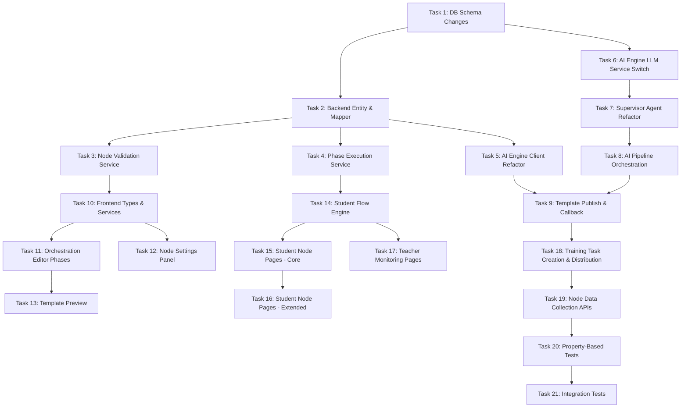

# Implementation Tasks: 实训编排节点AI重设计

## Task Dependency Graph

---

## Task 1: Database Schema Changes & Seed Data

- [x] Step 1: Create `wf_node_ai_status` table DDL in `infrastructure/db_mysql.txt`
  - Fields: id, template_id, node_id, node_type, phase_id, ai_status, error_reason, retry_count, result_json, last_processed_at, created_at, updated_at
  - Unique key on (template_id, node_id), index on (template_id, ai_status)
- [x] Step 2: Create `wf_node_config_schema` table DDL
  - Fields: id, node_type (unique), schema_json, schema_version, created_at, updated_at
- [x] Step 3: Create `biz_learning_survey_response` table DDL
  - Fields: id, participation_id, node_instance_id, student_id, responses_json, submitted_at, created_at, updated_at
  - Unique key on (participation_id, node_instance_id)
- [x] Step 4: ALTER `wf_training_template` — add `phases_json` JSON column after `raw_canvas_json`
- [x] Step 5: ALTER `wf_node_def` — add `ai_spec_json` JSON and `default_config_json` JSON columns
- [x] Step 6: ALTER `wf_node_instance` — add `phase_id` VARCHAR(64) column after `task_id`
- [x] Step 7: Insert seed data for `wf_node_def.ai_spec_json` for all 17 node types (start, resource_read, coding_class, learning_survey, task_distribute, req_upload, plan_upload, homework, exam, mindmap_preview, mindmap_draw, knowledge_eval, student_peer_review, inter_group_review, teacher_eval, end, grouping)
- [x] Step 8: Insert seed JSON Schema records into `wf_node_config_schema` for each node type defining the 6-dimension config structure

**Requirements:** 1.5, 1.6, 2.3, 11.5, 11.6, 24.1, 25.1, 25.2, 25.5

---

## Task 2: Backend Entity & Mapper Layer

- [x] Step 1: Create `WfNodeAiStatus` entity class with MyBatis-Plus annotations
- [x] Step 2: Create `WfNodeAiStatusMapper` extending BaseMapper
- [x] Step 3: Create `WfNodeConfigSchema` entity class
- [x] Step 4: Create `WfNodeConfigSchemaMapper` with `selectByNodeType` method
- [x] Step 5: Create `BizLearningSurveyResponse` entity class
- [x] Step 6: Create `BizLearningSurveyResponseMapper`
- [x] Step 7: Update `WfTrainingTemplate` entity — add `phasesJson` field
- [x] Step 8: Update `WfNodeDef` entity — add `aiSpecJson` and `defaultConfigJson` fields
- [x] Step 9: Update `WfNodeInstance` entity — add `phaseId` field
- [x] Step 10: Create `ValidationResult` DTO class with error field paths and reasons

**Requirements:** 1.5, 1.6, 2.3, 11.5, 24.1, 25.2

---

## Task 3: Node Validation Service (Backend)

- [x] Step 1: Create `INodeValidationService` interface with `validateNodeConfig(nodeType, configJson)` and `validatePhases(phasesJson)` methods
- [x] Step 2: Implement `NodeValidationServiceImpl` — 6-dimension structure check (exactly 6 required top-level keys, no extras)
- [x] Step 3: Implement JSON Schema validation logic using a JSON Schema library (e.g., `everit-org/json-schema` or `networknt/json-schema-validator`)
- [x] Step 4: Implement `validatePhases` — check array length 1-10, phase names 1-20 chars, sort_num uniqueness
- [x] Step 5: Add validation call in template save/publish controller — reject with 400 and field-level error details on failure
- [x] Step 6: Handle missing schema case — return error "节点类型缺少schema定义" when no schema record exists

**Requirements:** 1.1, 3.7, 25.1, 25.2, 25.3, 25.4
**Properties:** 1, 7, 10, 11

---

## Task 4: Phase Execution Service (Backend)

- [x] Step 1: Create `IPhaseExecutionService` interface with methods: `isPhaseComplete`, `getCurrentUnlockedPhaseId`, `enterNode`, `completeNode`
- [x] Step 2: Implement `isPhaseComplete` — query all wf_node_instance with is_required=true in the phase, check all corresponding wf_student_node_progress have status=2
- [x] Step 3: Implement `getCurrentUnlockedPhaseId` — iterate phases in sort_num order, return first incomplete phase
- [x] Step 4: Implement `enterNode` — create or update wf_student_node_progress (status=1, entered_at=now), update wf_student_activity_state.current_node_instance_id
- [x] Step 5: Implement `completeNode` — set status=2, exited_at=now, calculate stay_duration_seconds
- [x] Step 6: Add phase lock check — return 403 PHASE_LOCKED if student tries to access node in a locked phase
- [x] Step 7: Add expiry check — return 403 TASK_EXPIRED if current time > end_time

**Requirements:** 1.4, 27.1, 27.2, 27.3, 27.4, 27.5, 27.6, 27.7, 27.8
**Properties:** 3

---

## Task 5: AI Engine Client Refactor (Backend)

- [x] Step 1: Create `IAiEngineClient` interface with `triggerAiPipeline(templateId, canvasJson)` and `retryFailedNodes(templateId, nodeIds)` methods
- [x] Step 2: Implement `AiEngineClientImpl` — load ai_spec_json from wf_node_def for each node, inject into canvas JSON
- [x] Step 3: Implement `enrichWithAiSpecs` — iterate phases/nodes, lookup wf_node_def by node_type, attach ai_spec
- [x] Step 4: Implement async HTTP POST to ai-engine `/api/orchestration/process` with callback URL
- [x] Step 5: Implement `retryFailedNodes` — query wf_node_ai_status for failed nodes, build partial canvas, send to ai-engine
- [x] Step 6: Add scheduled task `AiTimeoutDetectionTask` — every 60s check templates with ai_status=1 older than 10 minutes, trigger status query

**Requirements:** 5.1, 5.2, 5.7, 5.8
**Properties:** 4, 8

---

## Task 6: AI Engine — LLM Service Switch to DeepSeek

- [x] Step 1: Update `ai-engine/.env` — set LLM_BASE_URL=https://api.deepseek.com, LLM_MODEL_NAME=deepseek-v4-flash
- [x] Step 2: Refactor `ai-engine/services/llm_service.py` — read config from env vars (LLM_BASE_URL, LLM_API_KEY, LLM_MODEL_NAME)
- [x] Step 3: Implement `invoke_with_retry` with tenacity — stop_after_attempt(3), wait_exponential(multiplier=2, min=2, max=8)
- [x] Step 4: Handle HTTP 429 — read retry-after header, cap at 60s, sleep then retry
- [x] Step 5: Handle 5xx and timeout — let tenacity retry with exponential backoff
- [x] Step 6: On final failure — raise exception with HTTP status code and last error message for upstream handling

**Requirements:** 6.1, 6.2, 6.3, 6.4, 6.5
**Properties:** 9

---

## Task 7: Supervisor Agent Refactor (AI Engine)

- [x] Step 1: Refactor `ai-engine/agents/supervisor.py` — remove hardcoded ROUTING_TABLE
- [x] Step 2: Implement `_should_process_node(node, ai_spec)` — check ai_spec validity, target_agent in valid set, at least one ai_flag enabled or source_mode="ai"
- [x] Step 3: Implement `detect_ai_nodes_phased(canvas_json)` — iterate phases/nodes, build AgentTask list sorted by priority
- [x] Step 4: Update `AgentTask` model in `models/schemas.py` — add phase_id, priority fields
- [x] Step 5: Handle teacher overrides — skip fields marked in `ai_processing._overrides`
- [x] Step 6: Log warnings for nodes with invalid ai_spec (null or invalid target_agent) without failing the pipeline

**Requirements:** 2.1, 2.2, 2.4, 2.5, 3.3, 5.2
**Properties:** 4, 5

---

## Task 8: AI Pipeline Orchestration & Callback (AI Engine)

- [x] Step 1: Update `ai-engine/routers/orchestration.py` — accept phased canvas_json with ai_spec per node
- [x] Step 2: Implement parallel node processing — asyncio.gather with per-node 60s timeout, overall 5min timeout
- [x] Step 3: Implement per-node status tracking — update wf_node_ai_status via callback for each node independently
- [x] Step 4: Refactor `ai-engine/services/callback.py` — retry callback 3 times (5s/15s/30s intervals)
- [x] Step 5: Implement selective retry endpoint — POST `/api/orchestration/retry` accepting template_id and list of failed node_ids
- [x] Step 6: Implement job store updates — track per-node completion, aggregate to overall job status
- [x] Step 7: Handle edge case: no nodes need AI processing — immediately callback success with ai_status=2

**Requirements:** 5.1, 5.2, 5.3, 5.4, 5.5, 5.6, 5.7, 24.2
**Properties:** 8

---

## Task 9: Template Publish & AI Callback Controller (Backend)

- [x] Step 1: Create/update `POST /api/teacher/templates/{id}/publish` endpoint — save raw_canvas_json, set ai_status=1, trigger AI pipeline async
- [x] Step 2: Create `POST /api/internal/ai/callback` endpoint — receive AI results, update standard_payload_json, set ai_status=2 or 3
- [x] Step 3: Implement per-node status update in callback — upsert wf_node_ai_status records
- [x] Step 4: Implement retry endpoint `POST /api/teacher/templates/{id}/retry` — check retry_count < 5, call AI engine for failed nodes only
- [x] Step 5: Add conflict check — reject publish if ai_status=1 (return 409)
- [x] Step 6: Add WebSocket notification on AI completion — notify teacher frontend of status change

**Requirements:** 5.1, 5.4, 5.5, 5.6, 5.7, 24.2, 24.3, 24.4

---

## Task 10: Frontend Types, Services & Store Foundation

- [x] Step 1: Create `frontend-vue/src/services/types/orchestration.ts` — Phase, OrchestrationNode, NodeConfig6D, CanvasJson, NodeAiSpec interfaces
- [x] Step 2: Create `frontend-vue/src/services/types/training.ts` — StudentNodeProgress, PhaseProgress, NodeAiStatus interfaces
- [x] Step 3: Create `frontend-vue/src/services/modules/orchestration.ts` — API calls for template CRUD, publish, retry, preview
- [x] Step 4: Create `frontend-vue/src/services/modules/studentTraining.ts` — API calls for student flow (enter node, submit, get progress)
- [x] Step 5: Create `frontend-vue/src/services/modules/teacherMonitor.ts` — API calls for teacher monitoring dashboard
- [x] Step 6: Create `frontend-vue/src/stores/modules/orchestration.ts` — Pinia store with phases, nodes, activePhase, selectedNode, CRUD actions
- [x] Step 7: Create `frontend-vue/src/stores/modules/studentFlow.ts` — Pinia store for student training runtime state

**Requirements:** 26.1, 26.4

---

## Task 11: Orchestration Editor — Phase Management UI

- [x] Step 1: Create phase tab bar component — display phases as tabs, support add/rename/reorder/delete
- [x] Step 2: Implement default 3-phase template on new template creation (课前/课中/课后)
- [x] Step 3: Implement phase delete confirmation dialog — warn about contained nodes being deleted
- [x] Step 4: Update canvas component to scope nodes/edges per active phase
- [x] Step 5: Implement drag-and-drop node into phase canvas — load default_config_json from node type definition
- [x] Step 6: Add phase time configuration (optional plan_start_time, plan_end_time)
- [x] Step 7: Enforce constraints: max 10 phases, phase name 1-20 chars

**Requirements:** 1.1, 1.2, 1.3, 1.7, 3.5

---

## Task 12: Orchestration Editor — Node Settings Panel

- [x] Step 1: Create node settings panel component — split into "教师手动设置区" and "AI自动生成区" based on ai_spec
- [x] Step 2: Implement AI field indicators — AI icon + "发布后由AI自动生成" tooltip on AI-zone fields
- [x] Step 3: Implement teacher override logic — mark field as overridden, show override badge, add "恢复AI生成" button
- [x] Step 4: Implement restore AI field — clear override value and flag
- [x] Step 5: Implement real-time validation (500ms debounce) — highlight missing required fields with red border and warning icon on node card
- [x] Step 6: Implement node hover tooltip (200ms delay) — show AI processing summary (field count + estimated time)
- [x] Step 7: Implement node settings for each node type (start, grouping, resource_read, etc.) per requirements 7-23

**Requirements:** 3.1, 3.2, 3.3, 3.4, 3.5, 3.6, 3.7, 7.1, 8.1, 9.1, 10.1, 11.1, 12.1, 13.1, 14.1, 15.1, 16.1, 17.1, 18.1, 19.1, 20.1, 21.1, 22.1, 23.1
**Properties:** 6

---

## Task 13: Template Preview Feature

- [x] Step 1: Create Template Preview page/modal — read-only view of full training flow organized by phases
- [x] Step 2: Display per-node: name, type icon, config summary, AI status (pending/complete/failed)
- [x] Step 3: Implement node detail expand — show full config and AI-generated content preview
- [x] Step 4: Implement "学生视角" toggle — simulate student page rendering
- [x] Step 5: Show AI-generated content when ai_status=2 (generated questions, summaries, welcome text)

**Requirements:** 4.1, 4.2, 4.3, 4.4, 4.5

---

## Task 14: Student Flow Engine (Backend APIs)

- [x] Step 1: Create `StudentFlowController` — GET `/api/student/tasks/{taskId}/overview` returning phases, nodes, progress
- [x] Step 2: Implement POST `/api/student/nodes/{nodeInstanceId}/enter` — call PhaseExecutionService.enterNode
- [x] Step 3: Implement POST `/api/student/nodes/{nodeInstanceId}/complete` — call PhaseExecutionService.completeNode
- [x] Step 4: Implement GET `/api/student/tasks/{taskId}/current-position` — return current phase and node
- [x] Step 5: Add role-based data filtering — student endpoints return only own data, no other students' info
- [x] Step 6: Implement activity state tracking — update wf_student_activity_state on enter/exit

**Requirements:** 26.5, 27.1, 27.2, 27.3, 27.4, 27.5, 27.6, 27.7, 27.8

---

## Task 15: Student Node Pages — Core Nodes

- [x] Step 1: Create `nodePageResolver.ts` — dynamic async component resolution by node_type and role
- [x] Step 2: Implement `StartPortal.vue` (student) — welcome text, flow overview, phase/node list with estimated durations
- [x] Step 3: Implement `ResourceViewer.vue` (student) — resource reading area, AI summary sidebar, progress bar, knowledge point highlights
- [x] Step 4: Implement `HomeworkEngine.vue` (student) — question list, answer area, submit, AI grading results
- [x] Step 5: Implement `ExamPage.vue` (student) — countdown timer, question navigation, answer area, submit
- [x] Step 6: Implement `SummaryReport.vue` (student/end node) — AI learning report, radar chart, achievement badges, satisfaction survey
- [x] Step 7: Create shared `NodePageLayout.vue` wrapper — handles enter/exit tracking, progress bar, navigation

**Requirements:** 7.4, 9.4, 15.4, 16.4, 23.4, 26.1, 26.2, 27.1

---

## Task 16: Student Node Pages — Extended Nodes

- [x] Step 1: Implement `GroupingPage.vue` — group info display, member list, leader badge
- [x] Step 2: Implement `LearningSurvey.vue` — questionnaire form (radio, checkbox, scale, text)
- [x] Step 3: Implement `TaskBoard.vue` — task overview, sub-task list, progress tracking
- [x] Step 4: Implement `RequirementCloud.vue` — file upload, AI review feedback, word cloud, history
- [x] Step 5: Implement `PlanUpload.vue` — file upload, AI feasibility radar chart, dimension scores
- [x] Step 6: Implement `SimulatedIDE.vue` — code editor (migrate from uav-encryption-teaching-demo), run, submit, AI review
- [x] Step 7: Implement `MindMapPreview.vue` — interactive mindmap viewer (expand/collapse)
- [x] Step 8: Implement `MindMapEditor.vue` — drag-and-drop mindmap drawing canvas, submit, AI evaluation
- [x] Step 9: Implement `KnowledgeEval.vue` — knowledge point list with difficulty rating and question input
- [x] Step 10: Implement `PeerReview.vue` — review form with dimension scores and comments
- [x] Step 11: Implement `InterGroupReview.vue` — group artifact review, dimension scoring, group consensus
- [x] Step 12: Implement `TeacherComment.vue` (student view) — personal score summary, teacher final comments

**Requirements:** 8.4, 11.2, 12.3, 13.4, 14.3, 10.2, 17.3, 18.3, 19.2, 20.4, 21.4, 22.4

---

## Task 17: Teacher Monitoring & Node Pages

- [x] Step 1: Create teacher monitoring dashboard page — phase-based progress overview, per-node student distribution
- [x] Step 2: Implement `TeacherStartPortal.vue` — participation stats, student entry status, nudge button
- [x] Step 3: Implement teacher node detail views — student progress list, key metrics, manual review entry
- [x] Step 4: Implement teacher actions: nudge students, force-complete node, manually unlock next phase
- [x] Step 5: Create `GET /api/teacher/tasks/{taskId}/monitor` API — aggregated progress data by phase/node
- [x] Step 6: Create `POST /api/teacher/tasks/{taskId}/nudge` and `POST /api/teacher/nodes/{nodeInstanceId}/force-complete` APIs
- [x] Step 7: Record teacher operations to `wf_teacher_node_operation` table

**Requirements:** 7.5, 8.5, 9.5, 10.4, 11.4, 12.4, 13.5, 14.4, 15.5, 16.5, 17.4, 18.4, 19.3, 20.5, 21.5, 22.3, 23.5, 26.3, 29.1, 29.2, 29.3, 29.4, 29.5

---

## Task 18: Training Task Creation & Student Distribution

- [x] Step 1: Create `POST /api/teacher/tasks` endpoint — create biz_training_task from template (requires ai_status=2)
- [x] Step 2: Implement node instance creation — for each node in each phase, create wf_node_instance with phase_id and config from standard_payload_json
- [x] Step 3: Implement student distribution — create biz_training_participation records based on dispatch_scope (class/course)
- [x] Step 4: Implement initial progress creation — for each student × each node, create wf_student_node_progress (status=0)
- [x] Step 5: Create teacher task creation form page — template selection, name, time range, distribution scope
- [x] Step 6: Add student workbench entry — display available training tasks, click to enter

**Requirements:** 30.1, 30.2, 30.3, 30.4, 30.5

---

## Task 19: Node Data Collection & Submission APIs

- [x] Step 1: Create `POST /api/student/nodes/{nodeInstanceId}/submit` — generic submission endpoint routing by node_type
- [x] Step 2: Implement resource_read data collection — reading_duration_seconds, scroll_percentage, knowledge_point_clicks → node_specific_data_json
- [x] Step 3: Implement coding_class submission — code content → biz_training_upload (upload_type=2), trigger async AI code review
- [x] Step 4: Implement homework/exam submission — answers → biz_student_answer_detail, trigger AI grading for subjective questions
- [x] Step 5: Implement file upload submissions (req_upload, plan_upload) — file → biz_training_upload (upload_type=1), trigger AI pre-review
- [x] Step 6: Implement mindmap submissions — map_topology_json → biz_mindmap_record, trigger AI structure evaluation
- [x] Step 7: Implement peer review submissions — scores + comments → fact_eval_result
- [x] Step 8: Add submission validation — required fields non-empty, format checks, return clear error messages on failure

**Requirements:** 9.6, 9.7, 9.8, 10.5, 13.6, 14.5, 15.6, 16.6, 17.5, 18.5, 18.6, 19.4, 20.6, 21.6, 22.5, 28.1, 28.2, 28.3, 28.4, 28.5

---

## Task 20: Property-Based Tests

- [x] Step 1: Set up hypothesis in ai-engine — install, configure 100+ iterations per test
- [x] Step 2: Implement Property 1 test (Phase validation) — generate random phase arrays, verify accept/reject correctness
- [x] Step 3: Implement Property 2 test (Canvas round-trip) — generate valid canvas JSON, serialize/deserialize, assert structural equality
- [x] Step 4: Implement Property 4 test (AI spec routing) — generate nodes with various ai_spec configs, verify correct routing
- [x] Step 5: Implement Property 5 test (AI flag skip) — generate nodes with all flags disabled, verify exclusion from task list
- [x] Step 6: Implement Property 8 test (Selective retry) — generate mixed success/failure results, verify retry targets only failures
- [x] Step 7: Implement Property 9 test (LLM retry backoff) — mock LLM failures, verify retry timing and attempt count
- [x] Step 8: Set up jqwik in backend-core — add dependency, configure
- [x] Step 9: Implement Property 3 test (Phase progression) — generate node sets with is_required flags, verify unlock logic
- [x] Step 10: Implement Property 10 test (6-dimension structure) — generate random JSON objects, verify validation correctness
- [x] Step 11: Implement Property 11 test (JSON Schema validation) — generate configs + schemas, verify accept/reject
- [x] Step 12: Set up fast-check in frontend-vue — install, configure
- [x] Step 13: Implement Property 6 test (Override round-trip) — generate field overrides and restores, verify state consistency

**Requirements:** All correctness properties from design document
**Properties:** 1, 2, 3, 4, 5, 6, 7, 8, 9, 10, 11

---

## Task 21: Integration Tests

- [x] Step 1: Backend integration test — template publish → AI engine trigger → callback → status update flow (mock AI engine)
- [x] Step 2: Backend integration test — student enter node → submit → complete → phase unlock flow
- [x] Step 3: AI Engine integration test — receive phased canvas → supervisor routing → agent execution → callback (mock LLM)
- [x] Step 4: AI Engine integration test — selective retry with mixed success/failure nodes
- [x] Step 5: Frontend integration test — orchestration editor phase CRUD, node drag, config save
- [x] Step 6: End-to-end smoke test — template create → publish → AI process → task create → student flow (all mocked externals)

**Requirements:** Cross-cutting validation of all requirements
