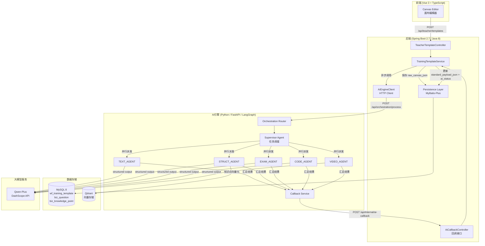
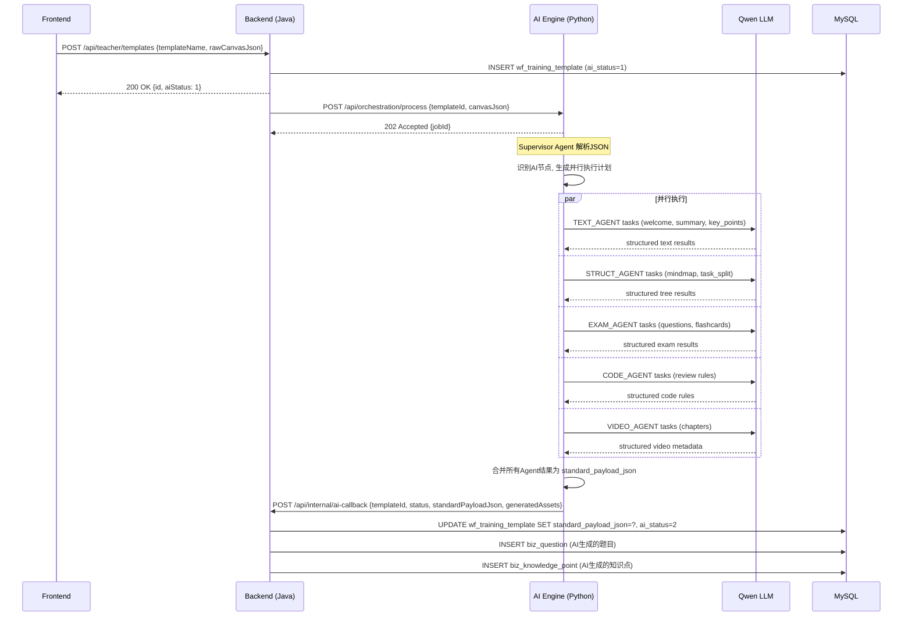

# Design Document: Training Orchestration AI Pipeline (实训编排AI流水线)

## Overview

本设计文档描述实训编排系统的完整数据流与AI多智能体处理架构。当教师在前端画布编辑器中发布实训模板时，系统需要：(1) 将原始画布JSON持久化到 `wf_training_template.raw_canvas_json`；(2) 解析JSON识别需要AI处理的节点（带有 `enable_ai_*: true` 标志或 `source_mode: "ai"` 的节点）；(3) 异步调度AI引擎进行内容生成；(4) 跟踪处理状态并在完成后将丰富结果存储为 `standard_payload_json`。

AI引擎采用基于LangGraph的多智能体架构，包含一个Supervisor Agent负责解析编排JSON并生成并行执行计划，以及五个领域专属Agent（TEXT_AGENT、STRUCT_AGENT、EXAM_AGENT、CODE_AGENT、VIDEO_AGENT）负责具体内容生成。所有Agent输出通过Pydantic模型约束，确保结构化数据可直接映射到MySQL业务表。

系统采用异步回调模式：Java后端通过HTTP POST将模板数据推送给AI引擎，AI引擎处理完成后通过回调接口通知后端，后端更新 `ai_status` 并持久化生成结果。

## Architecture

### System-Level Architecture



### Sequence Diagram: Template Publish Flow



## Components and Interfaces

### Component 1: AiEngineClient (Java Backend)

**Purpose**: HTTP客户端，负责将模板数据发送给AI引擎并处理回调

**Interface**:
```java
public interface IAiEngineClient {
    /**
     * 提交模板给AI引擎处理
     * @param templateId 模板ID
     * @param canvasJson 原始画布JSON
     * @return jobId 异步任务ID
     */
    String submitForProcessing(Long templateId, Object canvasJson);
    
    /**
     * 查询AI处理状态（备用轮询方案）
     * @param jobId 任务ID
     * @return 处理状态
     */
    AiJobStatus queryStatus(String jobId);
}
```

**Responsibilities**:
- 将模板JSON通过HTTP POST发送给AI引擎
- 处理网络超时和重试逻辑
- 提供轮询备用方案（当回调失败时）

### Component 2: AiCallbackController (Java Backend)

**Purpose**: 接收AI引擎处理完成后的回调通知

**Interface**:
```java
@RestController
@RequestMapping("/api/internal")
public class AiCallbackController {
    
    /**
     * AI处理完成回调
     * @param request 包含templateId, status, standardPayloadJson, generatedAssets
     */
    @PostMapping("/ai-callback")
    public ApiResult<Void> onAiComplete(@RequestBody AiCallbackRequest request);
}
```

### Component 3: Orchestration Router (Python AI Engine)

**Purpose**: 接收后端请求，启动LangGraph工作流

**Interface**:
```python
@router.post("/api/orchestration/process")
async def process_orchestration(request: OrchestrationRequest) -> OrchestrationResponse:
    """
    接收编排JSON，启动异步多智能体处理流程
    Returns: jobId for tracking
    """
    pass
```

### Component 4: Supervisor Agent (Python AI Engine)

**Purpose**: 解析编排JSON，识别AI节点，生成并行执行计划

**Interface**:
```python
class SupervisorAgent:
    async def analyze_orchestration(self, canvas_json: dict) -> ExecutionPlan:
        """解析JSON，返回并行任务执行计划"""
        pass
    
    async def dispatch_tasks(self, plan: ExecutionPlan) -> list[AgentResult]:
        """根据执行计划并行派发任务给领域Agent"""
        pass
```

### Component 5: Domain Agents (Python AI Engine)

**Purpose**: 五个领域专属Agent，各自负责特定类型的内容生成

**Interface**:
```python
class BaseAgent(ABC):
    @abstractmethod
    async def execute(self, task: AgentTask) -> AgentResult:
        """执行单个AI生成任务，返回结构化结果"""
        pass

class TextAgent(BaseAgent):       # 欢迎语、摘要、重点提炼
class StructAgent(BaseAgent):     # 思维导图、任务拆解
class ExamAgent(BaseAgent):       # 题目生成、闪卡生成
class CodeAgent(BaseAgent):       # 代码审查规则、评价指标
class VideoAgent(BaseAgent):      # 视频章节切片、字幕处理
```

## Data Models

### Request/Response Models (Java Backend)

```java
// AI引擎请求DTO
public class AiProcessRequest {
    private Long templateId;
    private String orchestrationId;
    private Object canvasJson;       // 原始编排JSON
    private String callbackUrl;      // 回调地址
}

// AI回调请求DTO
public class AiCallbackRequest {
    private Long templateId;
    private String jobId;
    private Integer status;          // 2=成功, 3=失败
    private Object standardPayloadJson;
    private String errorReason;
    private GeneratedAssets generatedAssets;
}

// AI生成的资产
public class GeneratedAssets {
    private List<QuestionDTO> questions;           // 生成的题目
    private List<KnowledgePointDTO> knowledgePoints; // 生成的知识点
    private List<EvalIndicatorDTO> evalIndicators;   // 生成的评价指标
}
```

### Pydantic Models (Python AI Engine)

```python
from pydantic import BaseModel, Field
from typing import Optional
from enum import Enum

class AgentType(str, Enum):
    TEXT = "TEXT_AGENT"
    STRUCT = "STRUCT_AGENT"
    EXAM = "EXAM_AGENT"
    CODE = "CODE_AGENT"
    VIDEO = "VIDEO_AGENT"

class OrchestrationRequest(BaseModel):
    template_id: int
    orchestration_id: str
    canvas_json: dict
    callback_url: str

class OrchestrationResponse(BaseModel):
    job_id: str
    status: str = "accepted"
    estimated_duration_seconds: int

class AgentTask(BaseModel):
    task_id: str
    agent_type: AgentType
    node_id: str
    node_type: str
    config: dict
    context: Optional[dict] = None

class ExecutionPlan(BaseModel):
    orchestration_id: str
    parallel_jobs: list[AgentTask]
    total_tasks: int

# --- Domain-specific output models ---

class GeneratedQuestion(BaseModel):
    question_type: int = Field(description="1-单选 2-多选 3-填空 4-判断 5-简答")
    content: str = Field(description="题干与选项JSON字符串")
    standard_answer: str
    default_score: float
    knowledge_point: Optional[str] = None

class GeneratedMindmap(BaseModel):
    root: str
    children: list[dict]

class GeneratedChapter(BaseModel):
    title: str
    start_time: str
    end_time: str
    summary: str

class GeneratedFlashcard(BaseModel):
    front_content: str
    back_content: str
    order: int

class TextAgentResult(BaseModel):
    node_id: str
    welcome_message: Optional[str] = None
    summary: Optional[str] = None
    key_points: Optional[list[dict]] = None
    navigation_tree: Optional[list[dict]] = None

class StructAgentResult(BaseModel):
    node_id: str
    mindmap: Optional[GeneratedMindmap] = None
    task_breakdown: Optional[list[dict]] = None
    knowledge_points: Optional[list[str]] = None

class ExamAgentResult(BaseModel):
    node_id: str
    questions: Optional[list[GeneratedQuestion]] = None
    flashcards: Optional[list[GeneratedFlashcard]] = None

class CodeAgentResult(BaseModel):
    node_id: str
    review_checkpoints: Optional[list[dict]] = None
    eval_indicators: Optional[list[dict]] = None

class VideoAgentResult(BaseModel):
    node_id: str
    chapters: Optional[list[GeneratedChapter]] = None

class AiCallbackPayload(BaseModel):
    template_id: int
    job_id: str
    status: int  # 2=success, 3=error
    standard_payload_json: Optional[dict] = None
    error_reason: Optional[str] = None
    generated_assets: Optional[dict] = None
```

**Validation Rules**:
- `template_id` must be positive integer
- `canvas_json` must contain `nodes` array and `edges` array
- Each node must have `node_id`, `node_type`, `name`, `config` fields
- `question_type` must be in range [1, 5]
- `default_score` must be positive

## Algorithmic Pseudocode

### Algorithm 1: AI Node Detection (Supervisor Agent)

```python
def detect_ai_nodes(canvas_json: dict) -> list[AgentTask]:
    """
    遍历编排JSON，识别所有需要AI处理的节点
    
    Preconditions:
    - canvas_json contains 'nodes' key with list of node dicts
    - Each node has 'node_id', 'node_type', 'config' keys
    
    Postconditions:
    - Returns list of AgentTask, one per AI-required operation
    - No node is missed if it has enable_ai_* = true or source_mode = "ai"
    - Tasks are correctly routed to appropriate agent type
    """
    tasks = []
    
    # Node type to agent type routing table
    ROUTING_TABLE = {
        "START": AgentType.TEXT,           # enable_ai_welcome
        "RESOURCE_READ": AgentType.TEXT,   # enable_ai_summary, key_points, quick_nav
        "VIDEO_LEARN": AgentType.VIDEO,    # enable_ai_subtitle, enable_ai_chapter
        "MINDMAP_PREVIEW": AgentType.STRUCT,  # enable_ai_generate_map
        "THEORY_CLASS": AgentType.EXAM,    # enable_ai_error_book (flashcards)
        "TASK_DISTRIBUTE": AgentType.STRUCT,  # enable_ai_task_split
        "HOMEWORK": AgentType.EXAM,        # source_mode == "ai"
        "CODING_CLASS": AgentType.CODE,    # enable_code_review
        "PLAN_UPLOAD": AgentType.CODE,     # enable_ai_pre_evaluation
        "AI_PRACTICE": AgentType.TEXT,     # system prompt generation
    }
    
    for node in canvas_json["nodes"]:
        config = node.get("config", {})
        node_type = node["node_type"]
        
        # Check for AI flags
        ai_flags = [k for k, v in config.items() 
                    if (k.startswith("enable_ai_") and v is True) 
                    or (k == "source_mode" and v == "ai")
                    or (k == "enable_code_review" and v is True)
                    or (k == "enable_ai_pre_evaluation" and v is True)]
        
        if ai_flags:
            agent_type = ROUTING_TABLE.get(node_type)
            if agent_type:
                tasks.append(AgentTask(
                    task_id=f"{canvas_json['orchestration_id']}_{node['node_id']}",
                    agent_type=agent_type,
                    node_id=node["node_id"],
                    node_type=node_type,
                    config=config
                ))
    
    return tasks
```

### Algorithm 2: LangGraph Workflow Execution

```python
async def execute_orchestration_workflow(
    canvas_json: dict, 
    template_id: int,
    callback_url: str
) -> str:
    """
    主工作流：解析 → 派发 → 并行执行 → 合并 → 回调
    
    Preconditions:
    - canvas_json is valid orchestration JSON
    - callback_url is reachable HTTP endpoint
    - LLM API key is configured and valid
    
    Postconditions:
    - All AI tasks are executed (or failed with error)
    - Callback is sent to backend with results
    - standard_payload_json contains enriched node configs
    
    Loop Invariants:
    - For parallel execution: each task is independent, no shared mutable state
    - All results are collected before merge step
    """
    job_id = generate_uuid()
    
    # Step 1: Supervisor analyzes and creates execution plan
    tasks = detect_ai_nodes(canvas_json)
    plan = ExecutionPlan(
        orchestration_id=canvas_json["orchestration_id"],
        parallel_jobs=tasks,
        total_tasks=len(tasks)
    )
    
    # Step 2: Parallel execution via LangGraph
    results = await asyncio.gather(
        *[execute_agent_task(task) for task in plan.parallel_jobs],
        return_exceptions=True
    )
    
    # Step 3: Merge results into standard_payload_json
    standard_payload = merge_results_into_payload(canvas_json, results)
    
    # Step 4: Extract generated assets for DB persistence
    generated_assets = extract_db_assets(results)
    
    # Step 5: Callback to Java backend
    callback_payload = AiCallbackPayload(
        template_id=template_id,
        job_id=job_id,
        status=2,  # success
        standard_payload_json=standard_payload,
        generated_assets=generated_assets
    )
    await send_callback(callback_url, callback_payload)
    
    return job_id
```

### Algorithm 3: Result Merging

```python
def merge_results_into_payload(
    original_json: dict, 
    agent_results: list
) -> dict:
    """
    将各Agent的输出合并回原始JSON，生成standard_payload_json
    
    Preconditions:
    - original_json is the raw canvas JSON
    - agent_results contains results keyed by node_id
    
    Postconditions:
    - Every node in output has its config enriched with AI results
    - Nodes without AI processing retain original config unchanged
    - Output JSON structure matches input structure (nodes + edges)
    """
    payload = deepcopy(original_json)
    
    # Build lookup: node_id -> agent_result
    result_map = {}
    for result in agent_results:
        if not isinstance(result, Exception):
            result_map[result.node_id] = result
    
    # Enrich each node's config with AI-generated content
    for node in payload["nodes"]:
        node_id = node["node_id"]
        if node_id in result_map:
            result = result_map[node_id]
            node["config"]["_ai_generated"] = result.dict(exclude_none=True)
            node["config"]["_ai_status"] = "ready"
        else:
            node["config"]["_ai_status"] = "not_required"
    
    return payload
```

## Key Functions with Formal Specifications

### Function 1: TrainingTemplateService.publishTemplate() (Java)

```java
@Transactional
public Long publishTemplate(String templateName, String description, 
                            Object canvasJson, Long creatorId)
```

**Preconditions:**
- `templateName` is non-null, non-empty, max 128 chars
- `canvasJson` is valid JSON containing `nodes` array and `edges` array
- `creatorId` references an existing `sys_user` with `role_type = 2` (teacher)

**Postconditions:**
- A new row is inserted into `wf_training_template` with `ai_status = 1`
- `raw_canvas_json` contains the exact input `canvasJson`
- An async HTTP call is dispatched to AI engine
- Returns the generated template ID (positive Long)

**Loop Invariants:** N/A

### Function 2: AiEngineClient.submitForProcessing() (Java)

```java
public String submitForProcessing(Long templateId, Object canvasJson)
```

**Preconditions:**
- `templateId` exists in `wf_training_template` with `ai_status = 1`
- AI engine is reachable at configured URL
- `canvasJson` is serializable to JSON

**Postconditions:**
- HTTP POST sent to AI engine `/api/orchestration/process`
- Returns `jobId` string (UUID format)
- If AI engine unreachable: throws `AiEngineUnavailableException`, template `ai_status` updated to 3

### Function 3: SupervisorAgent.analyze_orchestration() (Python)

```python
async def analyze_orchestration(self, canvas_json: dict) -> ExecutionPlan
```

**Preconditions:**
- `canvas_json` has valid structure with `nodes` and `edges`
- At least one node has AI-processing flags enabled

**Postconditions:**
- Returns `ExecutionPlan` with all AI-required tasks identified
- Each task has correct `agent_type` based on routing table
- No duplicate tasks for the same node_id + flag combination
- Tasks are independent (can be executed in parallel)

### Function 4: ExamAgent.generate_questions() (Python)

```python
async def generate_questions(self, config: dict) -> ExamAgentResult
```

**Preconditions:**
- `config` contains `question_type_counts` dict with valid type keys
- `config` contains `difficulty_level` in ["easy", "medium", "hard"]
- LLM API is available and responding

**Postconditions:**
- Returns exactly the number of questions specified in `question_type_counts`
- Each question has valid `question_type` matching its category
- Each question has non-empty `content` and `standard_answer`
- `default_score` is positive for all questions
- Output conforms to `GeneratedQuestion` Pydantic schema

**Loop Invariants:**
- For each question type batch: all generated questions match the requested type

### Function 5: AiCallbackController.onAiComplete() (Java)

```java
@PostMapping("/api/internal/ai-callback")
public ApiResult<Void> onAiComplete(@RequestBody AiCallbackRequest request)
```

**Preconditions:**
- `request.templateId` exists in `wf_training_template`
- `request.status` is either 2 (success) or 3 (failure)
- If status=2: `request.standardPayloadJson` is non-null valid JSON
- Request originates from trusted AI engine (internal network)

**Postconditions:**
- `wf_training_template.ai_status` updated to `request.status`
- If status=2: `standard_payload_json` is persisted
- If status=2 and `generatedAssets.questions` non-empty: rows inserted into `biz_question`
- If status=2 and `generatedAssets.knowledgePoints` non-empty: rows inserted into `biz_knowledge_point`
- If status=3: `error_reason` is persisted

## Example Usage

### Java Backend: Publishing a Template

```java
// TeacherTemplateController.java
@PostMapping("/api/teacher/templates")
public ApiResult<WfTrainingTemplate> create(@RequestBody TemplateCreateRequest request) {
    // 1. Save template with ai_status = 1
    WfTrainingTemplate template = new WfTrainingTemplate();
    template.setTemplateName(request.getTemplateName());
    template.setTemplateDescription(request.getTemplateDesc());
    template.setRawCanvasJson(request.getRawCanvasJson());
    template.setCreatorId(getCurrentUserId());
    template.setAiStatus(1);
    template.setCreatedAt(LocalDateTime.now());
    template.setUpdatedAt(LocalDateTime.now());
    templateService.save(template);
    
    // 2. Async dispatch to AI engine
    aiEngineClient.submitForProcessingAsync(template.getId(), request.getRawCanvasJson());
    
    return ApiResult.success(template);
}
```

### Python AI Engine: Processing Orchestration

```python
# routers/orchestration.py
@router.post("/api/orchestration/process")
async def process_orchestration(request: OrchestrationRequest, background_tasks: BackgroundTasks):
    job_id = str(uuid4())
    
    # Start async processing in background
    background_tasks.add_task(
        execute_orchestration_workflow,
        canvas_json=request.canvas_json,
        template_id=request.template_id,
        callback_url=request.callback_url,
        job_id=job_id
    )
    
    return OrchestrationResponse(
        job_id=job_id,
        status="accepted",
        estimated_duration_seconds=estimate_duration(request.canvas_json)
    )
```

### Python AI Engine: ExamAgent Generating Questions

```python
# agents/exam_agent.py
class ExamAgent(BaseAgent):
    async def execute(self, task: AgentTask) -> ExamAgentResult:
        config = task.config
        
        if config.get("source_mode") == "ai":
            questions = await self._generate_questions(config)
            return ExamAgentResult(node_id=task.node_id, questions=questions)
        
        if config.get("enable_ai_error_book"):
            flashcards = await self._generate_flashcards(config)
            return ExamAgentResult(node_id=task.node_id, flashcards=flashcards)
    
    async def _generate_questions(self, config: dict) -> list[GeneratedQuestion]:
        type_counts = config["question_type_counts"]
        difficulty = config["difficulty_level"]
        
        # Use structured output with Pydantic model
        response = await self.llm.with_structured_output(
            list[GeneratedQuestion]
        ).ainvoke(
            self._build_exam_prompt(type_counts, difficulty)
        )
        return response
```

## Correctness Properties

1. **完整性 (Completeness)**: ∀ node ∈ canvas_json.nodes, if node.config contains any `enable_ai_*: true` or `source_mode: "ai"`, then node.node_id ∈ execution_plan.parallel_jobs
2. **幂等性 (Idempotency)**: 对同一个 templateId 的重复回调不会产生重复的 biz_question 记录
3. **状态一致性 (State Consistency)**: `ai_status` 状态转换只允许 1→2 或 1→3，不允许 2→1 或 3→1
4. **结构保持 (Structure Preservation)**: standard_payload_json 保持与 raw_canvas_json 相同的 nodes/edges 拓扑结构
5. **类型安全 (Type Safety)**: 所有Agent输出必须通过Pydantic模型验证，不合规输出触发重试
6. **并行安全 (Parallel Safety)**: 各Agent任务之间无共享可变状态，可安全并行执行
7. **超时保护 (Timeout Protection)**: 单个Agent任务超过60秒自动终止，整体工作流超过5分钟触发失败回调

## Error Handling

### Error Scenario 1: AI Engine Unreachable

**Condition**: Java后端无法连接AI引擎（网络故障、服务宕机）
**Response**: 
- 捕获 `ConnectException` / `TimeoutException`
- 更新 `wf_training_template.ai_status = 3`
- 设置 `error_reason = "AI引擎连接失败，请稍后重试"`
- 记录错误日志
**Recovery**: 
- 提供手动重试接口 `POST /api/teacher/templates/{id}/retry-ai`
- 重试时重置 `ai_status = 1` 并重新提交

### Error Scenario 2: LLM API Rate Limit / Timeout

**Condition**: Qwen API返回429或请求超时
**Response**:
- 单个Agent任务失败不影响其他并行任务
- 失败任务进入指数退避重试（最多3次）
- 3次重试后标记该任务为失败
**Recovery**:
- 如果部分任务成功、部分失败：回调status=3，error_reason列出失败节点
- 后端可选择接受部分结果或全部重试

### Error Scenario 3: LLM Output Schema Violation

**Condition**: LLM返回的JSON不符合Pydantic模型约束
**Response**:
- Pydantic ValidationError被捕获
- 自动重试一次（附加更严格的schema提示）
- 第二次失败则标记该任务为error
**Recovery**:
- 记录原始LLM输出用于调试
- 该节点在standard_payload_json中标记为 `_ai_status: "error"`

### Error Scenario 4: Callback Delivery Failure

**Condition**: AI引擎无法将结果回调给Java后端
**Response**:
- 重试3次，间隔5s/15s/30s
- 将结果持久化到本地文件/Redis作为备份
**Recovery**:
- Java后端提供轮询接口 `GET /api/internal/ai-status/{templateId}`
- 定时任务每分钟检查 `ai_status=1` 超过10分钟的模板，主动查询AI引擎

### Error Scenario 5: Duplicate Callback

**Condition**: 网络抖动导致同一templateId收到多次回调
**Response**:
- 使用 `jobId` 作为幂等键
- 第二次回调检测到 `ai_status` 已为2，直接返回200忽略
**Recovery**: 无需额外恢复，幂等设计保证数据一致性

## Testing Strategy

### Unit Testing Approach

**Java Backend**:
- `TrainingTemplateServiceTest`: 测试模板保存逻辑、状态转换
- `AiCallbackControllerTest`: 测试回调处理、幂等性、参数校验
- `AiEngineClientTest`: Mock HTTP调用，测试超时/重试逻辑

**Python AI Engine**:
- `test_supervisor.py`: 测试节点检测算法覆盖所有16种节点类型
- `test_agents.py`: 每个Agent的输出schema验证
- `test_merge.py`: 测试结果合并逻辑保持JSON结构

### Property-Based Testing Approach

**Property Test Library**: Hypothesis (Python), fast-check概念验证

**Key Properties**:
1. 对任意合法的canvas_json，detect_ai_nodes返回的tasks数量 ≤ nodes数量
2. merge_results_into_payload的输出始终保持nodes和edges数组长度不变
3. 对任意GeneratedQuestion，question_type ∈ {1,2,3,4,5}

### Integration Testing Approach

- 端到端测试：从模板发布到AI回调完成的完整流程
- 使用Mock LLM（固定响应）验证数据流正确性
- 验证MySQL中biz_question记录数量与AI生成数量一致

## Performance Considerations

- **并行执行**: LangGraph并行执行独立Agent任务，预计5-8个任务可在单次LLM调用时间内完成
- **LLM调用优化**: 批量生成题目（一次调用生成所有题目而非逐题调用）
- **超时控制**: 单Agent 60s超时，整体工作流5分钟超时
- **线程池**: Java后端使用专用 `templateAiExecutor` 线程池（core=2, max=4），避免阻塞主线程
- **数据库批量写入**: AI生成的题目使用 `saveBatch()` 批量插入，减少DB连接开销
- **预估时间**: 典型16节点模板，AI处理预计30-90秒完成

## Security Considerations

- **内部接口保护**: `/api/internal/ai-callback` 仅允许AI引擎IP访问（通过SecurityConfig白名单）
- **API Key保护**: LLM API Key仅存储在AI引擎的 `.env` 文件中，不经过Java后端
- **输入校验**: 所有JSON输入经过schema验证，防止注入攻击
- **Token传递**: Java后端调用AI引擎时携带内部服务Token（非用户JWT）
- **速率限制**: AI引擎对 `/api/orchestration/process` 接口限制每分钟10次调用

## Dependencies

### Java Backend (新增)
- `spring-boot-starter-webflux` (WebClient for non-blocking HTTP calls to AI engine)
- 现有: Spring Boot 2.7, MyBatis-Plus 3.5.5, Jackson

### Python AI Engine (新增/升级)
- `langgraph==0.2.0` (已有，多智能体工作流)
- `langchain-openai==0.2.0` (已有，LLM调用)
- `httpx` (异步HTTP客户端，用于回调)
- `tenacity` (重试逻辑)
- `structlog` (结构化日志)

### Infrastructure
- MySQL 8 (已有)
- Qdrant (已有，用于知识点向量化)
- Docker Compose (已有)
